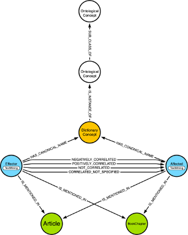
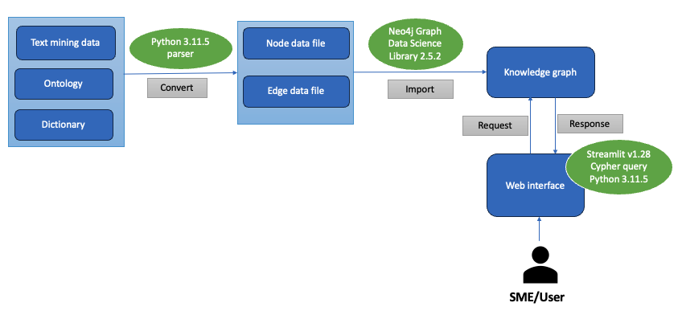
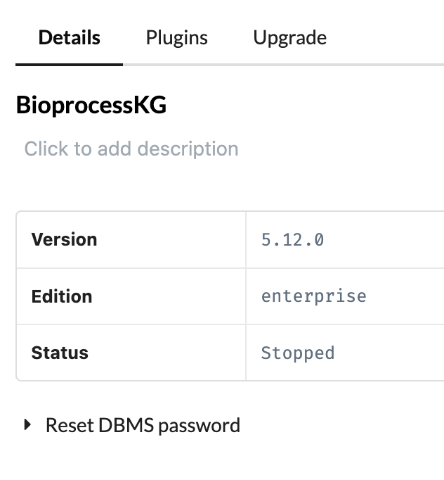
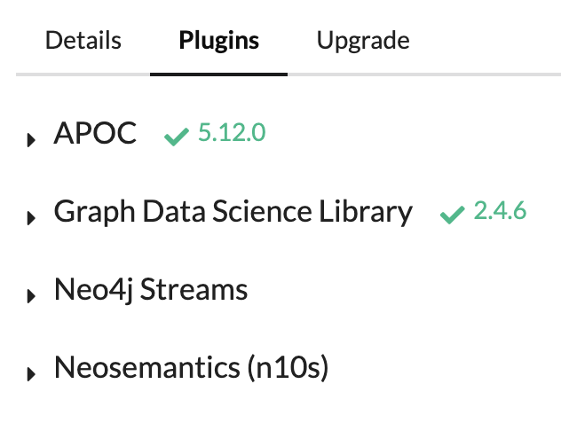
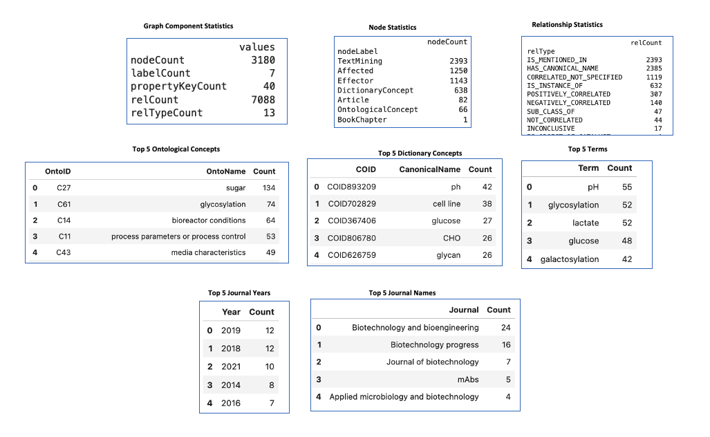
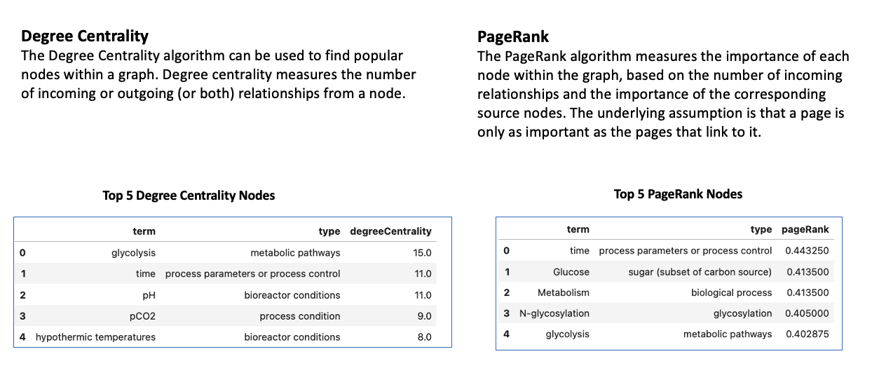

# Bioprocess Knowledge Graph

This repository contains data and Jupyter notebooks to build a Knowledge Graph for the UD and Waters Corporation collaboration project on Bioprocess.

## Overview
### Metagraph



In Neo4j, a metagraph is a virtual representation of the schema within the graph database. It doesn't contain the actual data but provides a high-level overview of the building blocks that make up the graph.

A metagraph captures:
* __Labels__: These represent the different categories of nodes in the graph (e.g., "OntologicalConcept", "Article"). The metagraph shows which labels exist in the database.
* __Relationship Types__: These define the connections between nodes (e.g., "SUBCLASSOF", "NEGATIVELY_CORRELATED"). The metagraph indicates the available relationship types.
* __Connections__: The metagraph illustrates how labels are connected through relationship types. It depicts a mini-graph showing how the different elements of your schema interact.

There are several advantages to using metagraphs in Neo4j:

* __Schema Exploration__: They provide a quick way to understand the structure and organization of the graph data. This can be helpful when you're new to a database or want to get a high-level grasp of its contents.
* __Data Analysis Planning__: By visualizing the relationships between labels, you can plan your data analysis queries more effectively. The metagraph can reveal potential connections and areas for exploration within your graph.
* __Identifying Issues__:  Inconsistencies or missing elements in your schema might be easier to spot by examining the metagraph.

Neo4j doesn't have a built-in function to directly generate a metagraph. However, you can achieve this using the APOC library, a popular extension for Neo4j. APOC ([Awesome Procedures on Cypher](https://neo4j.com/docs/apoc/current/)
) provides several procedures for introspecting your graph data, including creating metagraphs.


### Workflow

The raw data files we use to build the knowledge graph include a text-mining results file, an ontological concept file, and a dictionary concept file. A set of Jupyter notebooks was created to parse the raw data files and convert them into corresponding node files and edge files, then we used the Neo4j Graph Data Science Python library to load them into the Neo4j graph database. The default query language for the Neo4j graph database is [Cypher](https://neo4j.com/docs/cypher-manual/current/introduction/), which may not be familiar to most users or subject matter experts. We therefore developed a web-based interface using Streamlit library to facilitate the access of Knowledge Graph in a user-friendly manner.

## Set up Neo4j Database

There are several options on how to get started with Neo4j, and your choice depends upon your needs and goals. Each option allows you to explore different possibilities of the Neo4j ecosystem. Please refer t [Get Started with Neo4j](https://neo4j.com/docs/getting-started/get-started-with-neo4j/) for more information.

We use Neo4j Desktop, which is one of the ways to set up an environment for developing an application with Neo4j and Cypher®. Download Neo4j Desktop from [https://neo4j.com/download/](https://neo4j.com/download/) and follow the installation instructions for your operating system.

We used this version of Neo4j database in Neo4j Desktop for development, you can use this version to be compatible.



Please also make sure you have installed APOC and GDS plugins.



## Clone GitHub Repo and Set up JupyterLab

```
pip install jupyterlab
git clone https://github.com/udel-cbcb/UD_Waters_Bioprocess_KG.git
cd UD_Waters_Bioprocess_KG
jupyter-lab
```

## Building the Knowledge Graph
After creating a Neo4j graph database, you can follow the steps below to build the Knowledge Graph.

### Step 0 (optional): Clean up the Knowledge Graph

Run [cleanup_knowledge_graph.ipynb](cleanup_knowledge_graph.ipynb) notebook will delete all the nodes, edges, indexes and constraints in the Neo4j graph database!!!! You can run this script if any of the rest steps failed and you have a incomplete database. This makes sure you have a fresh database to start with. If you just created a fresh Neo4j graph database, you can skip this step.

### Step 1: Load Ontological Concepts

Run [load_ontological_concepts.ipynb](load_ontological_concepts.ipynb) notebook reads in the ontology file ('data/Ontology.xlsx') in Excel format and convert it into a nodes file ('data/Onto_nodes.tsv') and an edges file ('data/Onto_edges.tsv') in table separated values file format for loading into Neo4j database.

### Step 2: Load Dictionary Concepts

Run [load_dictionary_concepts.ipynb](load_dictionary_concepts.ipynb) notebook reads in the dictionary concept file ("data/Concepts.obo") in OBO format and convert it into a tab separated values file ("data/Concepts.tsv") for loading into Neo4j database.

### Step 3: Load Text Mining Data

Run [load_text_mining_data.ipynb](load_text_mining_data.ipynb) notebook reads in the textmining results file ('data/FL_ABS_Chap.xlsx') in Excel format and convert it into a nodes file ('data/FL_ABS_Chap_Nodes.tsv') and an edges file ('data/FL_ABS_Chap_Edges.tsv') in table separated values file format for loading into Neo4j database.

### Step 4: Get Article Metadata from PubMed

Run [get_article_metadata_from_pubmed](get_article_metadata_from_pubmed.ipynb) notebook gets metadata from PubMed using metapub python library, create Article nodes and link the TM nodes to Article nodes.

### Step 5: Get Book Chapter Metadata

Run [get_book_chapter_metadata.ipynb](get_book_chapter_metadata.ipynb) notebook gets metadata for book chapter from a Excel file ('data/BookChapter_Metadata.xlsx'), create BookChapter node and link the TM nodes to it.

### Step 6: Graph Exploratory Data Analysis

Run [graph_eda.ipynb](graph_eda.ipynb) notebook performs graph exploratory data analysis and generate some graph statistics.

#### KG Summary Statistics



#### Graph Data Science Algorithms

